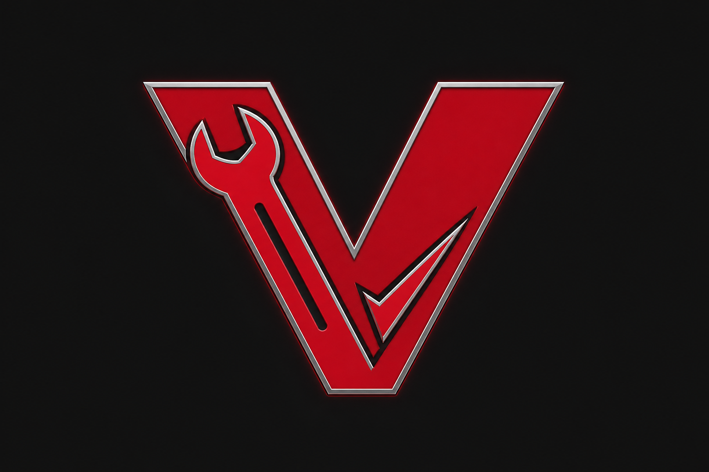

<p align="center">
  
</p>

<h1 align="center">Vtool — Avatar Auto-Fixer Pro</h1>

<p align="center">
  A free Unity Editor tool for VRChat creators.<br/>
  Scan your avatar before upload, fix common SDK errors, and reduce texture size — without leaving Unity.
</p>

<p align="center">
  <a href="https://github.com/DARKSIDE957/Vtool/releases/latest"></a>
  
  
</p>

---

## What is Vtool?

**Vtool** is a pre-upload helper for VRChat avatars. It lives inside Unity and checks your avatar root for problems that often block or warn during VRChat SDK validation — missing components, broken materials, bad audio settings, heavy textures, and more.

You pick your avatar, read a clear report, apply safe fixes with one click, then upload through the normal VRChat SDK panel.

| | |
|---|---|
| **Runs in** | Unity Editor (not in-game) |
| **Install via** | VRChat Creator Companion (VCC) |
| **Cost** | Free |
| **Source** | Open on GitHub — you can read every line of code |

### What it helps with

- **Check** — See blockers and warnings before you hit Upload
- **Fix** — One-click safe fixes for scripts, materials, bounds, audio, lip sync, and scene conflicts
- **Textures** — Cap import sizes (512 / 1024 / 2048), restore originals, convert Quest shaders

### What it does *not* do

- Does not upload your avatar for you
- Does not replace the VRChat SDK or bypass its rules
- Does not auto-fix pink/broken shaders (you still reassign those manually)
- Does not guarantee upload success — always keep a backup

---

## Install

You need **Unity 2022.3+**, the **VRChat Avatars SDK**, and the **VRChat Creator Companion (VCC)**.

### 1. Add the Vtool repository in VCC

1. Open **VCC → Settings → Packages**
2. Click **Add Repository**
3. Paste this URL:

```
https://raw.githubusercontent.com/DARKSIDE957/Vtool/main/index.json
```

### 2. Add the package to your project

1. Open your VRChat avatar project in VCC
2. Click **Manage Project**
3. Find **Vtool Avatar Auto-Fixer Pro** and click **Add** (or **Update** if you already have it)

Vtool appears under **Unity → Vtool → Avatar Auto-Fixer Pro**.

> Updates can apply while Unity is open. If the window looks stale after updating, use **Vtool → Apply Package Update (Reload)**.

---

## How to use

```
Unity menu → Vtool → Avatar Auto-Fixer Pro
```

1. **Assign your avatar root** (or click **Auto-Detect** if it’s in the scene)
2. Open the **Check** tab — read blockers and warnings
3. Click **Backup Avatar** before changing anything
4. Open the **Fix** tab → **Fix All Upload Errors**
5. Open the **Textures** tab if you need smaller textures or Quest shaders
6. Upload with the **VRChat SDK** as usual

---

## Features

### Check tab

Scans **30+ common issues**, including:

**Upload blockers**
- Missing `VRCAvatarDescriptor` or `PipelineManager`
- Missing humanoid Animator
- Missing scripts, null material slots, broken shaders
- Missing meshes, extreme polygon count

**Warnings**
- View position / lip sync not configured
- High poly count, too many materials or PhysBones
- 4K / 2K+ textures, missing mipmaps
- Bad audio settings, extra avatars in scene
- Non-Quest shaders for Android uploads

### Fix tab

**Fix All** runs safe, non-visual fixes:

- Remove missing scripts
- Fill null material slots (hair-safe — preserves slot order)
- Add `PipelineManager` if missing
- Fix skinned mesh bounds
- Fix audio (3D spatial, volume cap, disable play on awake)
- Enable texture mipmaps
- Disable other avatars in the scene
- Align view position and set up lip sync

Individual fixes are available under **Individual fixes** if you only want one change.

### Textures tab

- Reduce texture import size to **512**, **1024**, or **2048**
- Restore original import sizes anytime
- Convert materials to **Quest / Android** shaders (with optional material duplication)

---

## Safety

Always **back up your avatar** before running fixes. Vtool includes a one-click **Backup Avatar** button that duplicates your hierarchy in the scene.

This tool is provided as-is. You are responsible for your project files and upload results. When in doubt, test on a copy first.

---

## Support

If Vtool saves you time, optional tips are welcome:

**[Buy Me a Coffee](https://buymeacoffee.com/Omv1)** — completely optional; the tool stays free either way.

For bugs or feature ideas, open an issue on [GitHub](https://github.com/DARKSIDE957/Vtool/issues).

---

<p align="center">
  <sub>Made for the VRChat creator community by <strong>DARKSIDE957</strong></sub>
</p>
