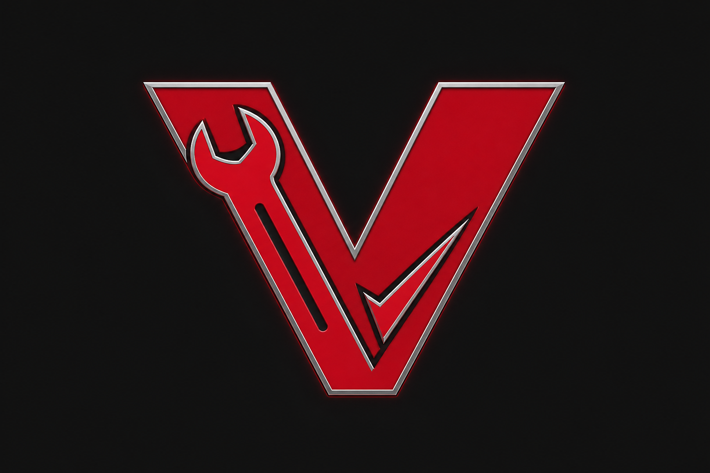

<div align="center">



# Vtool: Avatar Auto-Fixer Pro

**Pre-upload checks and fixes for VRChat avatars in Unity.**

Scan your avatar, fix the usual SDK problems, shrink textures, then upload like normal.

<br/>

[](https://github.com/DARKSIDE957/Vtool/releases/latest)
[](https://unity.com/)
[](https://vcc.docs.vrchat.com/)

</div>

<br/>

> [!IMPORTANT]
> **Please make sure to read the [Important](#known-issue-head-disappearing) section** before using Fix All / Auto Fix. Prefer Individual fixes.

<br/>

## Overview

Vtool is a Unity Editor window for VRChat avatar creators. Point it at your avatar root and it tells you what is wrong before you upload.

| | |
|:--|:--|
| **Where** | Unity Editor only |
| **Install** | VRChat Creator Companion (VCC) |
| **Price** | Free |
| **Code** | Open source on this repo |
| **Languages** | English, Arabic, Spanish, French (bilingual labels) |

<br/>

## Languages and help

Pick a language in the window header. Non-English UI shows bilingual labels like `فحص (Check)` or `Vérifier (Check)`. VRChat terms such as **PhysBones**, **PipelineManager**, and **Quest** stay in English. Arabic window text is shaped for Unity IMGUI; Arabic pop-ups use dialog-safe shaping so letters stay connected and read right-to-left.

Hover buttons for tooltips. Major actions also show a short caption explaining what they do and what they will not delete.

<br/>

## The 3 tabs

<table>
<tr>
<td width="33%" valign="top">

### Check
Blockers, warnings, and a performance snapshot.

Poly count, textures, VRChat setup, PhysBones, audio, Quest shaders, and more.

</td>
<td width="33%" valign="top">

### Fix
Safe one-click fixes. No mesh or object removal.

Scripts, materials, bounds, audio, lip sync, view position, PipelineManager.

</td>
<td width="33%" valign="top">

### Textures
Lower import size or prep for Quest.

Cap to 512 / 1024 / 2048, restore originals, convert mobile shaders.

</td>
</tr>
</table>

<br/>

## Install

**Requirements:** Unity 2022.3+, VRChat Avatars SDK, VCC

**Step 1.** VCC → **Settings** → **Packages** → **Add Repository**

```text
https://raw.githubusercontent.com/DARKSIDE957/Vtool/main/index.json
```

**Step 2.** Open your project in VCC → **Manage Project** → add **Vtool Avatar Auto-Fixer Pro**

**Step 3.** In Unity: **Vtool → Avatar Auto-Fixer Pro**

> [!TIP]
> You can update while Unity is open. If the window looks old after an update, use **Vtool → Apply Package Update (Reload)**.

<br/>

## Quick start

1. Drop your **avatar root** into the tool (or **Auto-Detect**)
2. **Check** tab: read what failed
3. **Backup Avatar** or rely on auto rollback before fixes
4. **Fix** tab: **Fix All Safe Upload Errors**
5. If anything breaks: **Rollback Avatar**
6. **Textures** tab: only if you need smaller textures or Quest shaders
7. Upload through the **VRChat SDK**

<br/>

## What gets checked

<details>
<summary><b>Upload blockers</b></summary>

- Missing `VRCAvatarDescriptor` or `PipelineManager`
- Missing humanoid Animator
- Missing scripts
- Null material slots
- Broken shaders (pink materials)
- Missing meshes
- Extreme polygon count
- Over 256 PhysBone components (VRChat hard limit)

</details>

<details>
<summary><b>Warnings</b></summary>

- View position / lip sync not set
- Chest bone not mapped
- Bad root or negative scale
- High poly count, materials, PhysBones, particles
- 4K / 2K+ textures, missing mipmaps
- Audio not 3D, too loud, play on awake
- Other avatars active in scene
- Non-Quest shaders

</details>

<details>
<summary><b>What Fix All changes</b></summary>

Fix All is conservative. It does **not** delete meshes, GameObjects, or material slots. It also **never removes anything on the head, face, or hair**.

- Fills null material slots using a nearby material on the same renderer (never invents placeholders on head/face)
- Adds `PipelineManager` if missing
- Fixes audio (3D, volume, play on awake)
- Sets view position **only if empty**
- Sets lip sync **only if empty**

**Skinned mesh bounds are not changed by Fix All** — use the Individual **Fix skinned mesh bounds** action if you need that (it still skips head/face).

Missing scripts and excess PhysBones (scripts only — never GameObjects/meshes, and never on head/face/hair), mipmaps, scene avatars, and placeholder materials are under **Individual fixes** with a confirmation dialog.

Pink shaders still need manual reassignment.

</details>

<br/>

## Safety

> [!WARNING]
> Vtool saves a **rollback copy** before fixes. If something looks wrong, click **Rollback Avatar** in the Fix tab.

Vtool will **not** delete GameObjects, meshes, or the head/face/hair region. PhysBone reduction and missing-script cleanup skip that area on purpose.

You can also use **Backup Avatar** for a visible copy in the scene, or Unity **Ctrl+Z** for the last edit.

Test on a copy of your project if you are unsure.

<br/>

## Known issue: head disappearing

> [!IMPORTANT]
> I am **still trying my best** to stop the head / face from disappearing after Fix — especially on **Japanese Booth bases** (Manuka, Powari, Lime/Chiffon-family, meshes like `*_atama`, face often named `Body`).
>
> This is **not** because the avatar is short or tall. The usual cause is bad **skinned mesh bounds** (frustum cull): the mesh is still there, Unity just stops drawing it. Wrong materials on a missed face mesh can look the same.
>
> **v2.4.1** removes bounds from Fix All, expands JP/Booth head-face detection (`rootBone` Head, more romaji/base names), and hardens face material handling. Prefer **Individual fixes**. **Do not always use Fix All / Auto Fix.**
>
> Arabic: dialogs should show connected RTL text (native popups no longer get IMGUI-reversed Arabic).
>
> Suggested flow: **Check** → **Backup Avatar** → run one Individual fix at a time.
>
> If the head disappears:
> 1. Click **Rollback Avatar** immediately (or Unity **Ctrl+Z**)
> 2. Note which Fix button you used (**Fix All**, **Reduce PhysBones**, **Remove missing scripts**, etc.)
> 3. Use **Check → Copy Error Codes** and [open an issue](https://github.com/DARKSIDE957/Vtool/issues) with that report + avatar setup notes

<br/>

## Changelog

### v2.4.4
- Fix language picker rejecting French (was capped at Spanish index)

### v2.4.3
- Full **French** language support (UI, dialogs, scan messages) with bilingual labels

### v2.4.2
- Support link switched from Buy Me a Coffee to [Ko-fi](https://ko-fi.com/c/4e4397f93e)

### v2.4.1
- Fix All no longer rewrites skinned mesh bounds (Individual only; still skips head/face)
- Stronger JP/Booth head-face protection (`rootBone` Head/Neck/Jaw/Eyes, more name tokens, MMD/viseme shapes)
- Safer materials on protected face/head (no array expansion / placeholders)
- Arabic native dialogs: shape connected letters without IMGUI reverse (fixes upside-down / LTR popups)
- Docs: clarify head cull is bounds-related, not avatar height

### v2.4.0
- Quest/mobile PhysBone warnings (8 components / 64 transforms / colliders)
- Warn when a single PhysBone affects more than 256 transforms
- Package version shown in the window header
- Clearer Fix All confirmation (prefer Individual fixes)
- Docs refresh

### v2.3.0
- Manuka/Powari-style head cull fix (`*_atama`, skip head bounds rewrite)

### v2.2.9
- Compact window layout (tabs stay visible; content scrolls)

<br/>

## Links

- [Releases](https://github.com/DARKSIDE957/Vtool/releases)
- [Report a bug](https://github.com/DARKSIDE957/Vtool/issues)
- [Ko-fi](https://ko-fi.com/c/4e4397f93e) (optional)

<br/>

<div align="center">
<sub>by DARKSIDE957</sub>
</div>
